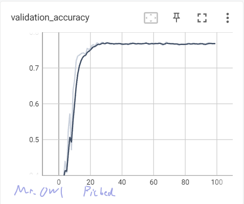
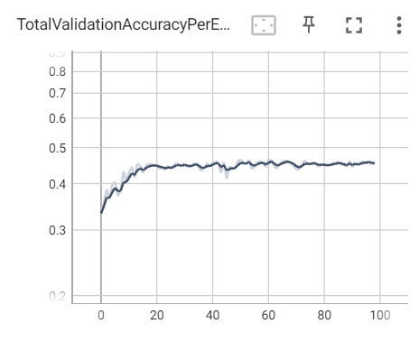
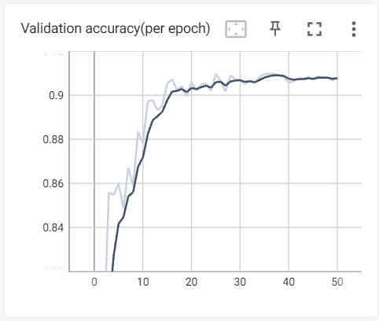
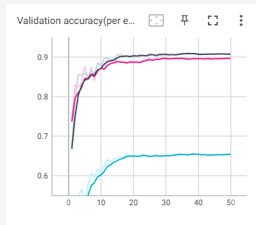
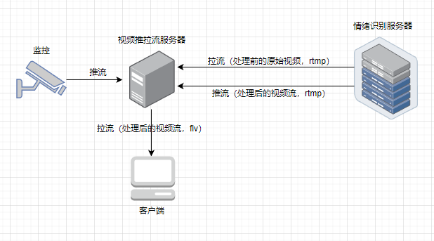
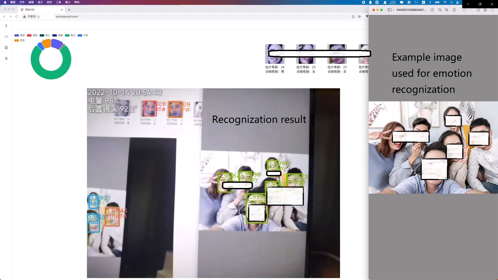
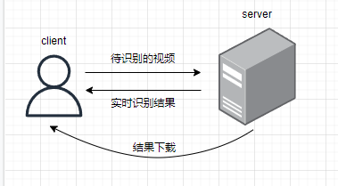
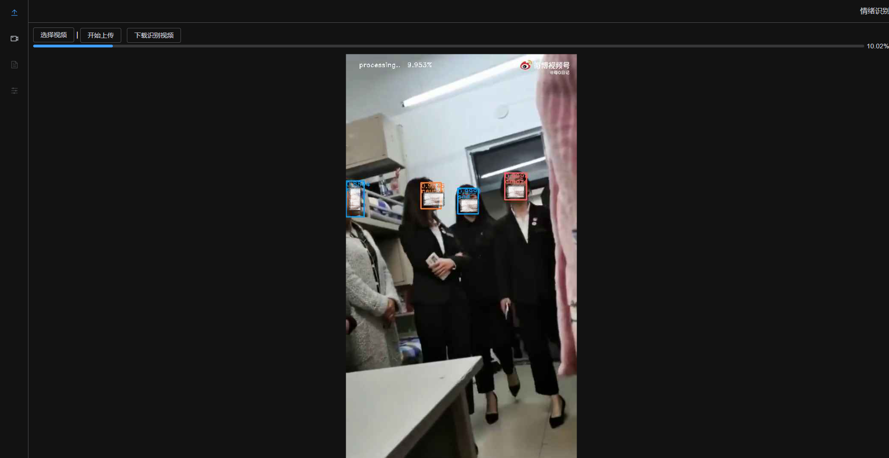
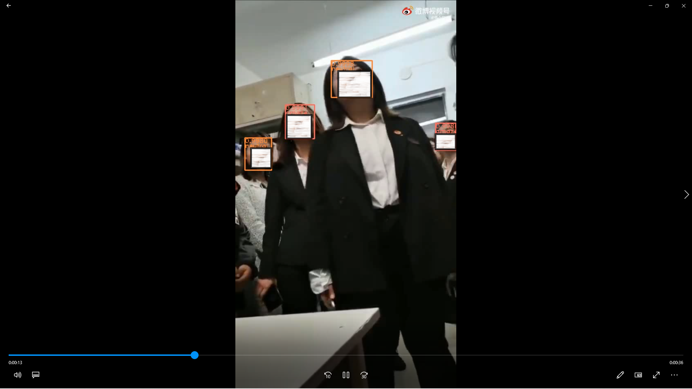

# Face后端部分

## 功能介绍

该项目目前具有两大功能：离线视频表情识别和在线监控表情识别识别。

+ 离线视频表情识别：用户通过上传提前录制的视频进行情绪识别，可以看到实时处理进度，处理完毕后可以下载
+ 在线监控表情识别：用户将监控视频流推送至指定地址，可以看到20fps左右的实时处理结果。

## 开源项目引用

人脸识别部分采用RetinaFace; 情绪识别部分采用Amend-Representation-Module;性别、年龄识别以及特征提取来自ArcFace-Python

## 模型

### 模型选用

我们比较了三个轻量化的情绪识别模型（[Dan](https://github.com/yaoing/DAN)/[Deep-Emotion](https://github.com/omarsayed7/Deep-Emotion)/[ARM](https://github.com/JiaweiShiCV/Amend-Representation-Module.git)）,并在Ubuntu环境下各运行100个epoch，结果如下：

| Project      | Dataset | Validation aCCURACY（峰值） | graph                                                        |
| ------------ | ------- | --------------------------- | ------------------------------------------------------------ |
| Dan          | Raf-DB  | 77.03%                      |  |
| Deep_Emotion | FER2013 | 45.21%                      |  |
| ARM          | Raf-DB  | 90.72%                      |  |

`DeepEmotion`的正确率差故不予考虑；`Dan`的识别正确率低于`ARM`约15%，综合各方面考虑，最终选择`ARM`作为表情识别的基本框架。

### 数据集

为进一步增强对于不同图片类型的识别能力，我们将`raf-db`与`fer2013`数据进行部分混合，并与单纯使用`RAF-DB`与`FER2013`进行训练最后结果进行对比，结果如下：



其中，黑色线条表示使用`RAF-DB`进行训练的训练结果；红线是使用`fer2013`及`raf-db`混合训练的训练结果；蓝线是单独使用`fer2013`进行训练的结果。这三种数据集使用同种神经网络进行训练，其中`fer2013`为了适应原数据加载器输入在dataset类进行了部分修改，`raf-db+fer2013`在源数据集上进行了重命名。

显然，单独使用`radfb`取得了最佳的训练效果，且曲线收敛好于其他两者。

## 技术栈

### 前端

主要技术栈：`Vue3` + `Vite` + `TypeScript`

重要插件：`flv.js`(支持实时视频流播放)、`socketio`(支持长连接)、`ElementUI Plus`(UI 组件库)

### 后端

见依赖文件

## 服务部署

### 登录

身份认证：jwt

### 实时监控

#### 前端部分

使用`flv.js`插件

```javascript
if (flvjs.isSupported()) {
  //...
  let flvPlayer = flvjs.createPlayer(
    {
      type: 'flv',
      isLive: true, //此选项一定要配置成true
      url: 'http://xxx.xxx',
    },
    {
      enableStashBuffer: false, //此选项一定要配置成false， 否则会造成视频流播放卡顿！
    }
  )
  flvPlayer.attachMediaElement(videoRef.value) //videoRef为要绑定的video标签的ref
  flvPlayer.load()
  flvPlayer.play()
}
```

同时需要进行`socket`连接（使用`socketio`）， 以实时显示识别表情数据内容。
在不需要连接时需要手动关闭连接，具体 api 可以参考[socketio 官网](https://socket.io/)。

> 关于视频比例(一般情况下)：
>
> 优先宽度自适应比例。

#### 后端部分

这一模块分为两大部分：视频推/拉流服务以及情绪识别部分，即Flask+Flask-socketio+rtmp推流实现服务。其中Flask-socketio用于实时传输人脸识别结果以及统计数据，rtmp用于实现摄像头的链接。为解决ws://协议不安全问题，我们对指定域名申请cert，使用NGINX做SSL反向代理。同时考虑到nginx代理rtmp时on_push这一回调不支持ssl，我们单独为其开辟了一个端口。前端需要flash才能播放rtmp视频，但目前这一插件已经废弃，所以我们将rtmp转换为flv格式交由前端处理。下文将对这些协议的用途作简要介绍。

表情识别服务器配置文件（wss.conf）:

```nginx
server {
     listen 8000;
     server_name YOUR_DOMAIN;
     location / {
         proxy_pass http://localhost:port;
    }
}
server {
     listen port ssl;
     server_name YOUR_DOMAIN;
     ssl_certificate /etc/nginx/ssl/DOMAIN.crt;
     ssl_certificate_key /etc/nginx/ssl/DOMAIN.key;
     ssl_session_timeout 5m;
     ssl_protocols TLSv1 TLSv1.1 TLSv1.2;
     ssl_ciphers ECDHE-RSA-AES128-GCM-SHA256:HIGH:!aNULL:!MD5:!RC4:!DHE;
     ssl_prefer_server_ciphers on;

     location / {
         proxy_pass http://localhost:port;
         proxy_http_version 1.1;
         proxy_set_header Upgrade $http_upgrade;
         proxy_set_header Connection "Upgrade";
     }
}
```

对于视频推/拉流服务端，nginx在编译时需要加入`nginx-http-flv-module`:

```bash
./configure --add-module=/path/to/nginx-http-flv-module
make
make install
```

推/拉流服务端配置文件rt.conf：

```nginx
worker_processes auto;
rtmp_auto_push on;
events {}
rtmp {
    idle_streams off;
    server {
        listen port;
        listen [::]:port ipv6only=on;
        chunk_size 4096;
        drop_idle_publisher 10s;
        timeout 30s;
        on_publish http://domain:port/startPush;
        on_publish_done http://domain:port/endPush;
        application live {
            live on;
            record off;
        }
    }
}
http {
    include mime.types;
    default_type application/octet-stream;
    server {
        listen port;
        server_name ip;
 		location /flv {
   			flv_live on;
            chunked_transfer_encoding on;
   			add_header 'Access-Control-Allow-Credentials' 'true';
            add_header 'Access-Control-Allow-Origin' '*';
            add_header Access-Control-Allow-Headers X-Requested-With;
            add_header Access-Control-Allow-Methods GET,POST,OPTIONS;
            add_header 'Cache-Control' 'no-cache';
        }
    }
}
```

这是这一部分的后端框架图：



#### 结果展示

实际运行截图：



考虑到实时监控部分需要情绪识别结果反馈，项目开始时我们不采用推拉流服务器，而是直接使用websocket进行识别后的图片（将视频流拆分为图片后进行识别）以及识别结果的传输，但前端频繁断开连接，且过于占用cpu。改进后的版本中我们废弃了ws中的图片传输，仅使用ws进行实时识别结果传输，情绪识别服务器处理后的视频流我们利用ffmpeg将其传输至视频推拉流服务器，经过nginx转换为flv后由前端进行展示。

对于画面延迟过大问题，前端禁用了缓冲区，同时后端开启两个线程，线程1用于从视频流中取出帧并放入队列中，并及时删除来不及处理的帧；线程2从队列中取帧进行处理，处理后交由ffmpeg推送。

### 离线视频

#### 前端部分

使用 `ElementUIPlus` 的 `Upload` 组件，上传成功后使用 `socketio` 建立 `websocket` 连接，接收后端的实时处理的返回的 `ArrayBuffer`，将 `ArrayBuffer` 转成 `base64`，并绑定于 `img` 标签 `src` 属性上。
`ArrayBuffer` => `base64` 方法如下：

- 方法一：

1. 首先通过 `socketio` 获取到传来的二进制流数据
2. 然后拿到所需的二进制数据(`ArrayBuffer`)将其转为 `base64`

```javascript
function arrayBufferToBase64(buffer) {
  var binary = ''
  var bytes = new Uint8Array(buffer)
  var len = bytes.byteLength
  for (var i = 0; i < len; i++) {
    binary += String.fromCharCode(bytes[i])
  }
  return window.btoa(binary)
}
```

3. 通过上面的函数将二进制数据转为 `url`

```javascript
let url = arrayBufferToBase64(response)
```

4. 将生成的 `url` 放入 `img` 标签的 `src` 属性中

```javascript
document.getElementById('img').src = 'data:image/jpeg;base64,' + url
```

- 方法二（推荐）：

1. 前端读取为 ArrayBuffer, 通过视图操作，取出图片的二进制流，生成 Blob 对象
2. 读取 blob 对象， 返回 URL 格式的字符串（base64 编码）以表示所读取文件的内容
   前端 img 标签 src 赋值为 base64 字符串，显示视频流图片。

```javascript
const blob = new Blob([arg.img], { type: 'image/jpeg' }) //arg.img为后端发送的ArrayBuffer
onlineVideo.value = URL.createObjectURL(blob)
```

> 关于视频比例(一般情况下)：
>
> 当视频宽度 > 视频高度时将完整显示宽度，高度自适应比例；
>
> 当视频宽度 < 视频高度时将完整显示高度，宽度自适应比例.

#### 后端部分

这一模块接收用户上传的视频并在后台进行识别。从视频中取出每一帧进行识别后，将识别结果通过ws回传至前端，同时存入本地。用户得知识别结束后，可以进行下载操作。

为实现人脸去重，我们采用ArcFace提供的sdk，使用python调用该sdk(https://github.com/niehen6174/face_detection_and_recognition)

我们将retinface识别到的人脸部分进行裁剪，并交由sdk识别。sdk计算出人脸特征后存入本地，之后每一帧重复该操作，并对比计算出的人脸特征是否已经存在于本地，如果不存在，则为出现的新人脸。这个sdk同时提供性别以及年龄检测。

同时支持下载历史记录

历史记录方面，我们将识别的视频记录在数据库中，并取出视频的首帧作为缩略图上传腾讯云的对象存储。

这是这一部分的后端框架图：



#### 结果展示

实时处理界面：



视频（处理前）：


视频（处理后）：



## 其它

### 跨域问题

在本地环境（开发环境），部分请求会有跨域问题，需要在`vite.config.ts`文件中配置`proxy`。

```TypeScript
server: {
    proxy: {
      "/api": {
        target: "https://xxx.xxx",
        changeOrigin: true,
        rewrite: (path) => path.replace(/^\/api/, ""),
      },
      "/livestream": {
        target: "http://xxx.xxx",
          changeOrigin: true,
          rewrite: (path) => path.replace(/^\/livestream/, ""),
      }
    },
  },
```

